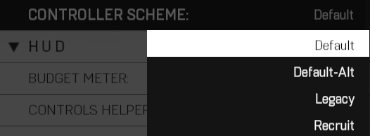
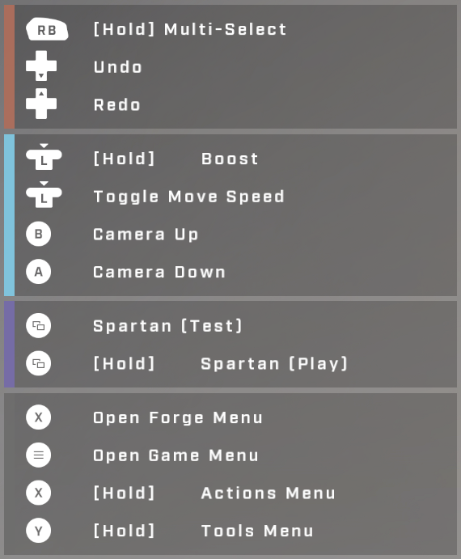
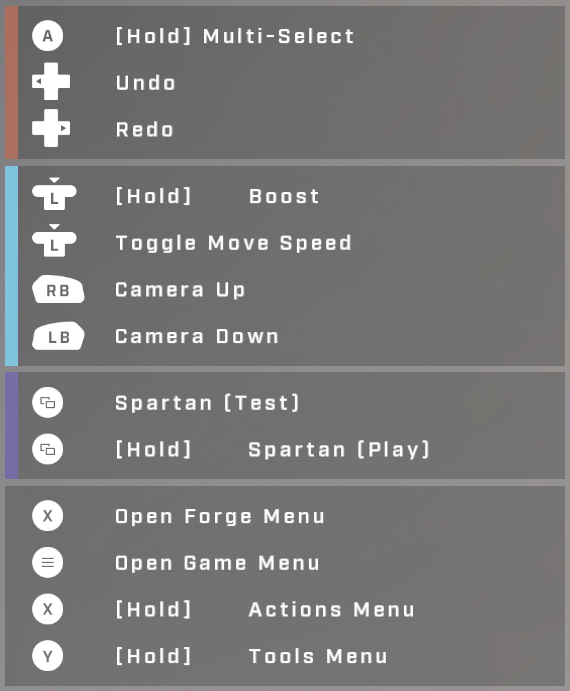
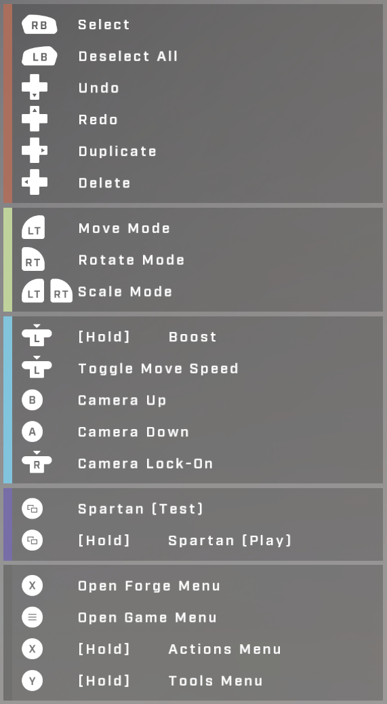
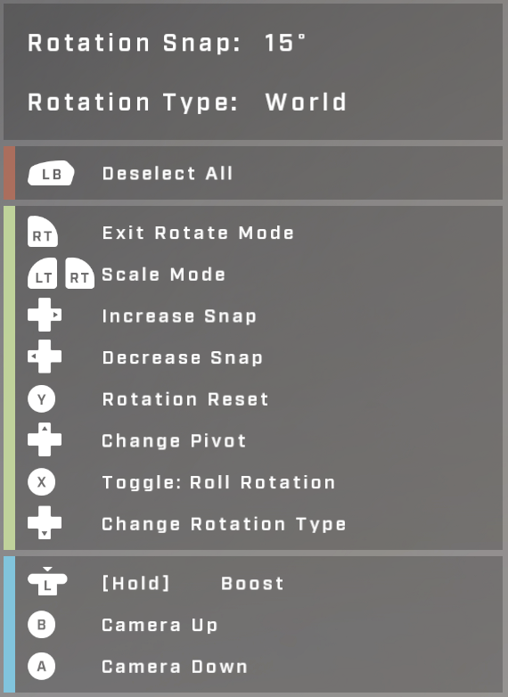
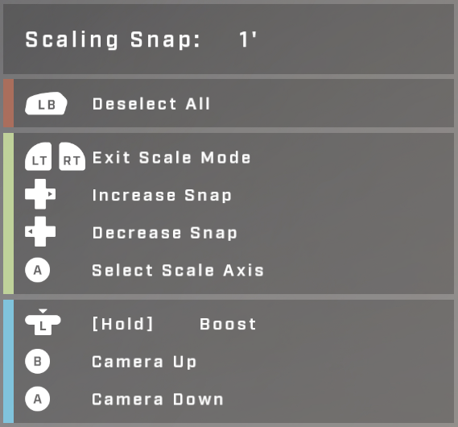

# Controller

## Description

Controller button mappings optimized for different Forging styles. If you struggle with the selection and camera controls found in **Default**, try **Recruit** as it is intended for those new to Forge. Returning Halo 5 Forgers may prefer **Legacy**.

## Controller Schemes

### Standard Forge Controls

<figure><figcaption>
Default / Default-Alt / Legacy - Controller Controls
</figcaption></figure>

<figure><figcaption>
Recruit - Controls
</figcaption></figure>

### Default

<figure><figcaption>
Default Controller - Object Move
</figcaption></figure>

<figure><figcaption>
Default Controller - Object Rotate
</figcaption></figure>

<figure><figcaption>
Default Controller - Object Scale
</figcaption></figure>

#### Move

**Selection**

|Control|Button|
|:--|:--|
|Select| Right Button (RB)|
|Deselect All| Left Button (LB)|
|Undo| Down Arrow D-Pad|
|Redo| Up Arrow D-Pad|
|Duplicate| Right Arrow D-Pad|
|Delete|Left Arrow D-Pad|

**Mode Select**

|Control|Button|
|:--|:--|
|Move Mode| Left Trigger|
|Rotate Mode| Right Trigger|
|Scale Mode| Left Trigger + Right Trigger|

#### Rotate

#### Scale

### Default-Alt

### Legacy

### Recruit
