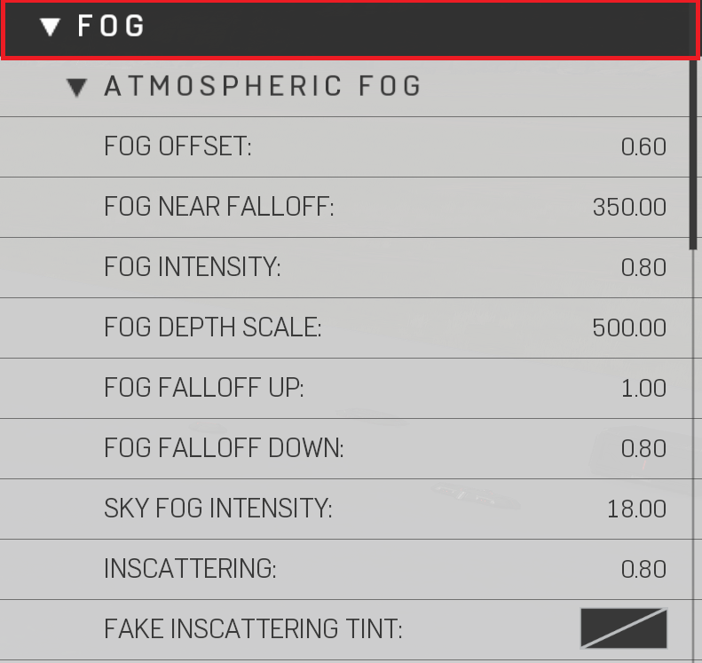

# Atmospheric Fog

|Property Name|Description|
|:-- | :--|
|Fog Offset | Distance to offset the fog falloff from where fog starts to the horizon
|Fog Near Falloff | Distance from player when atmospheric fog starts rendering
|Fog Intensity | Sets the atmospheric fog density
|Fog Falloff Up | Atmospheric fog falloff going upwards from the horizon
|Fog Falloff Down | Atmospheric fog falloff going down from the horizon
|Sky Fog Intensity | How much Fog is in the atmosphere | Color is based on "Sky Tint Override"
|Inscattering | The amount of light that scatters throughout the atmosphere (Reference Image Inscattering)|
|Fake Inscattering Tint | Sets a false color scatter thorough the atmosphere \| Inscattering must be under 1 (Reference Image Inscattering) |

