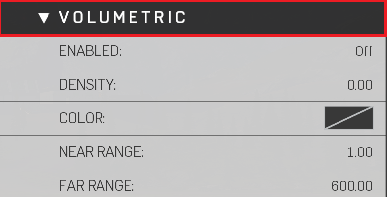

# Volumetric Fog


Volumetric Fog simulates a 3D fog that can be used to create light rays, take in color from lights, or provide a general haze around world.


|Property Name|Description|
|:-- | :--|
|Color | Sets color|
|Density | How thick the volumetric fog is|
|Enabled | Toggles volumetric fog On/Off|
|Far Range | Distance from player when volumetric fog "Stops" rendering|
|Near Range | Distance from player when volumetric fog "Starts" to render|