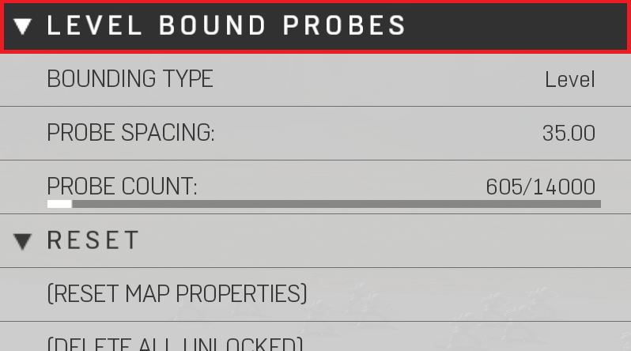

# Level Bound Probes

Level bound probes to rendering your indirect for the map. Level stretching across the whole map, object scaling based on player placed objects, or none. (No level volume)

|Property Name|Description|
|:-- | :--|
|Bounding Type | 2 sets of bounding probes: (Reference Image Bounding Type Level & Object) <ul><li> Level: Will encompass the entire gameplay canvas</li><li>Object: Will automatically encompass all player placed objects in the scene</li>|
|Probe Spacing | Sets distance between probes; Lower spacing will result in more accurate indirect lighting, but increased build times. Higher spacing will result in less accurate but faster build times.|
|Probe Count | Estimates the number of probes based on probe spacing. This is shared between the "Level Bound Probes" and "Light Probe Marker" object. More probes will result in longer build times. |

