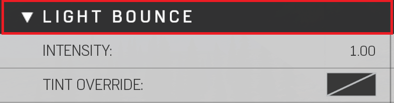

# Light Bounce


Light bounce is a combination of the Sun, Local lights, and any Emissives near air probes (Indirect lighting). Increasing will have strong indirect effects around the map and changing color will give a universal color to all indirect lighting. If you would like to sample these contributors separately set to "no Color" (Defaults to white and uses whatever color is near a specific probe).


|Property Name|Description|
|:-- | :--|
|Intensity|Changes the brightness of the bounce lighting from the Sun, Local lights, and emissives|
|Tint Override|Changes color of bounce light (Reference Image Tint Override)|

