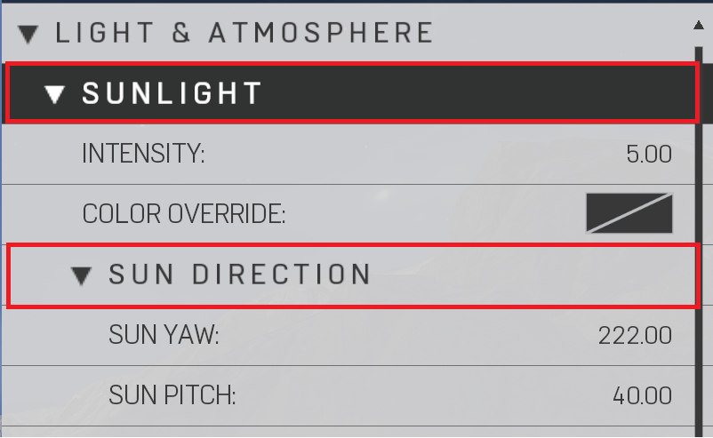

# Sunlight & Sun Direction


Controls the Sun direction, intensity, and color. A good note is that the sun will still render even going past 90 degrees on the horizon. Unless it is wanted, or you would like to have a fully interior map with no sun contribution, set the intensity to 0 and it will save performance but turning the sun "off".


|Property Name|Description|
|:-- | :--|
|Intensity|Changes the brightness of the sunlight|
|Color Override|Changes the color of the sunlight|
|Sun Direction||
|Sun Yaw|Cardinal direction sun position (Left and Right) (Reference Image Sun Yaw)|
|Sun Pitch|Time of day sun position (Up and Down) (Reference Image Sun Pitch)|

