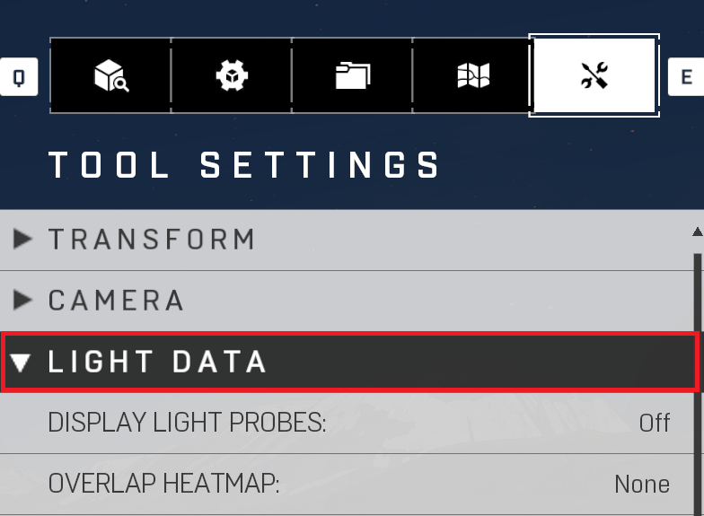
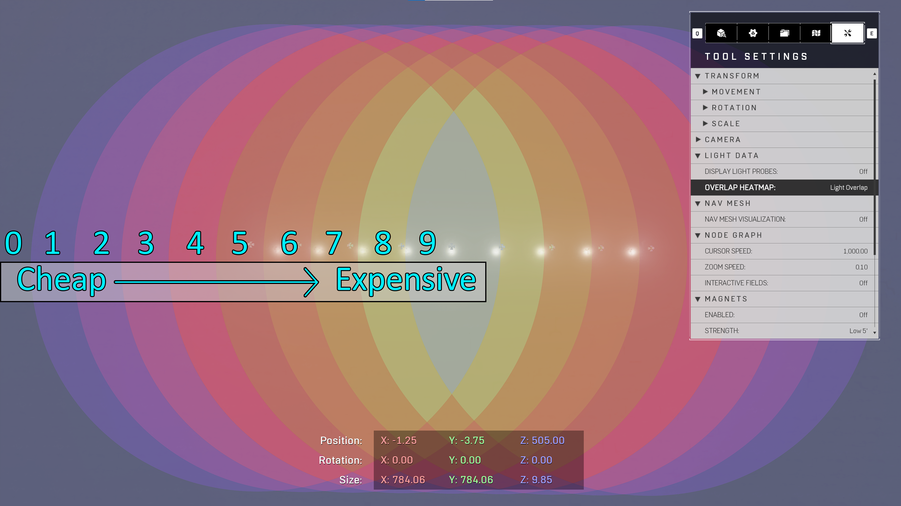

# Light Data - Tool Settings

The Light Data settings are mostly for Debug/Performance tools. Checking how your probes are being lit, and performance of your lights and shadows placed around the map. Extremely useful for performance as you will know if there are hotspots to adjust for lighting. Also will show you why there will be artifacts in your lighting like a black void in your indirect. That will usually mean that there are probes in geo and you will need to move the geo or adjust the spacing to get them out of there.

|Property Name|Description|
|:-- | :--|
|Display Light Probes | Toggles the display of the light probes (Reference Image Display Overlay Probes)
| Overlay Heatmaps | Shows Overlap for lights and shadows, the higher the number overlap the more expensive the pixels in that cluster are. Best to use OBB Volume it help the overlap cost, adjust light cone angle, or delete lights (Reference Image_ <ul><li>Light Heatmap (How many lights are overlapping, a performance debug mode. The brighter the color from Blue (A0, no local lights, cheap) to Beige (A9, many local lights, very expensive) are how expensive that section of your map is.</li><li>Shadow Heatmap (How many shadow are overlapping, a performance debug mode. The brighter the color from Blue (A0, no shadows, cheap) to Beige (A9, many shadows, very expensive) are how expensive that section of your map is.</li></ul> _Notes: For lower specs if **shadows** go to "**4**" (Reference Image Overlay Heatmap) you will see flickering in your shadows. Use OBBs to adjust overlap._ |

