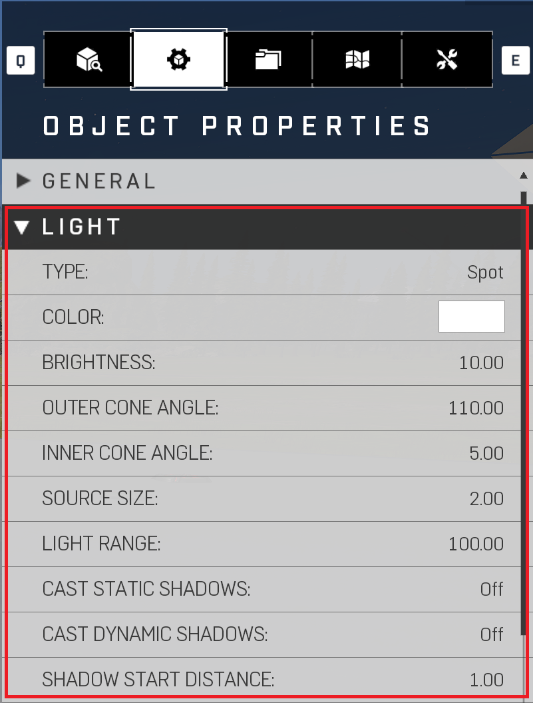
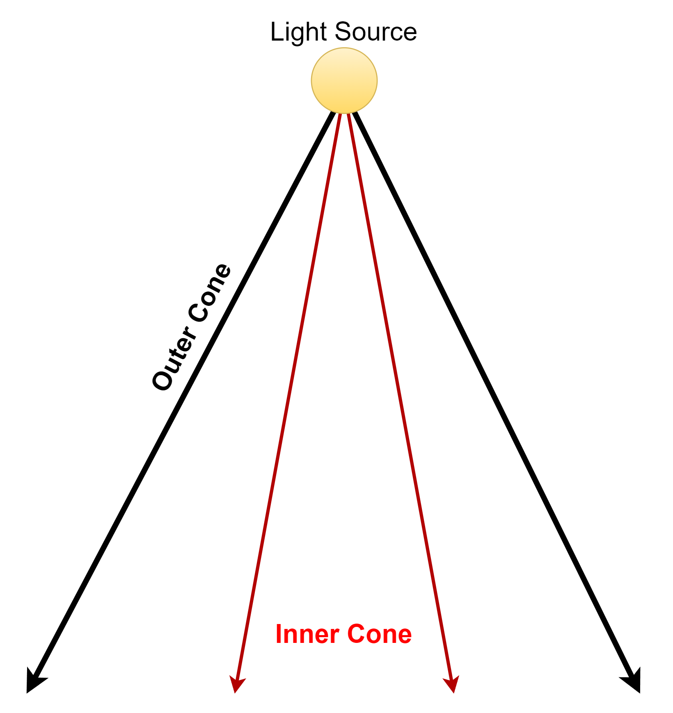
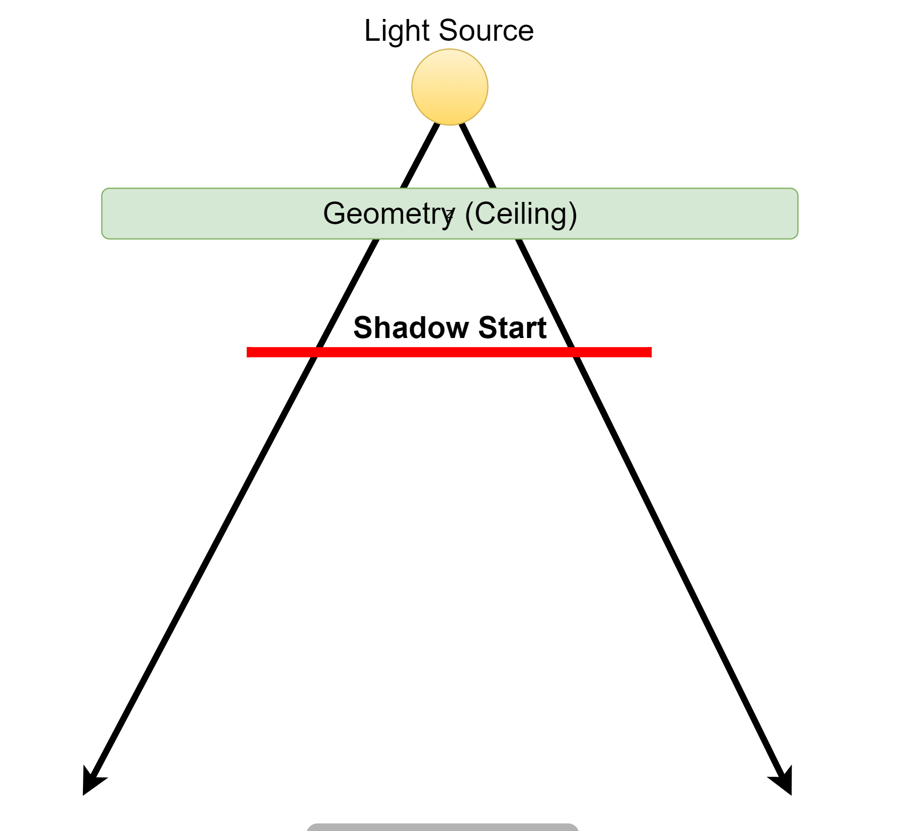

# Light Properties

## Description

Properties and more.

|Property Name|Description|
|:-- | :--|
|Type|Sets the light to be "Spot" (directional) or "Point" (omnidirectional).|
|Color|Changes the color of light source.|
|Brightness|How bright the light is.|
|Outer Cone Angle (Only Spot Type)|Angle/Frustum of the outer spotlight cone. (Reference Image Light Source Outer-Inner Cone) |
|Inner Cone Angle (Only Spot Type)|Angle/Frustum of the inner spotlight cone.|
|Source Size|Modifies the softness of the light source. (Reference Image Light Source Outer-Inner Cone)|
|Light Range|Distance at which the light falls off.|
|Cast Static Shadows|Enables shadows for static objects.|
|Cast Dynamic Shadows|Enables shadows for dynamic objects, adds additional expense.|
|Shadow Start Distance|Distance from source at which the shadows start. (Reference Image Light Shadow Start Distance)|

## List of settings

* [Animation](animation.md)
* [Cone](cone.md)
* [Gobo](gobo.md)
* [OBB](obb.md)
