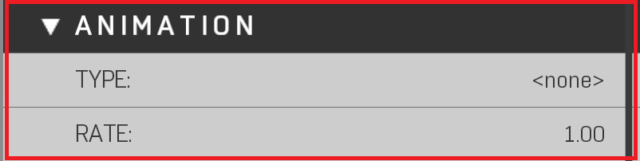

# Annimation


Animations are used to create Flickering lights


|Property Name|Description|
|:-- | :--|
|Type|Applies an animation to the light.|
|Rate|Changes the Light animation Speed (Higher faster, lower slower)|
