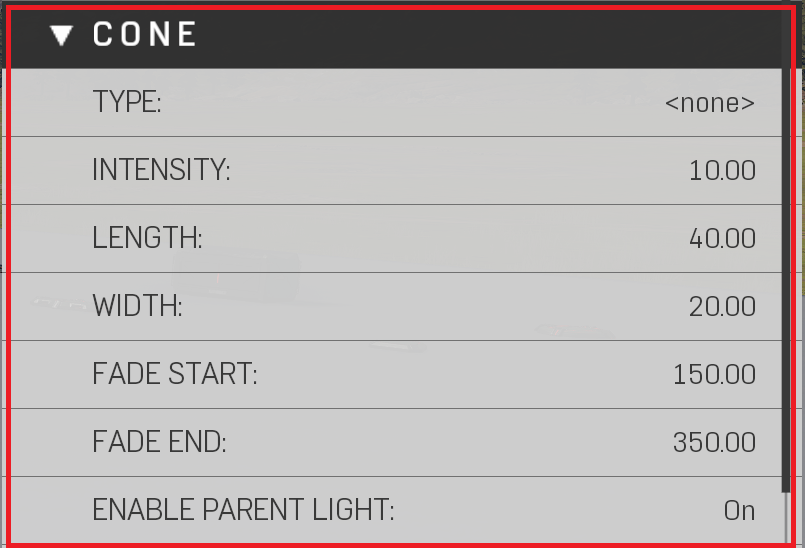

# Cone


Light cones are versatile, cheap to render billboard objects. Used to create fake lighting effects, such as, light rays, fog, mist, smoke. Also used to create depth and pathing.


|Property Name|Description|
|:-- | :--|
|Type|The light cone attached to the object. (Reference Image Types of Light Cones)|
|Intensity|How bright the light cone is.|
|Length|Changes the length of the light cone; Stacking multiple light cones over one another, or the larger the light cone takes up on screen, the more performance cost it has.|
|Width|Changes the width of the light cone; Stacking multiple light cones over one another, or the larger the light cone takes up on screen, the more performance cost it has.|
|Fade Start|Distance from player when the light cone starts to fade.|
|Fade End|Distance from player when the light come completely fades.|
|Enable Parent Light | Toggles the light to be on/off; used when only a light cone is desired.|

