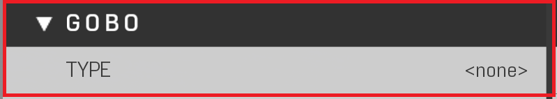

# Gobo


Gobos are patterns projected from lights to give different lighting results. Examples being water caustics, faking shadows, or placing a Banished logo.


|Property Name|Description|
|:-- | :--|
|Gobo Information|There can only be a limit of 4 Unique gobos rendering at the same time. Duplicates work fine, but 5+ gobos in close proximity still rendering will cause the gobos to flicker or not render correctly|
|Type|Applies a stencil (pattern) projected from the light (Only works on "Spot" lights). (Reference Image Types of Gobos|

