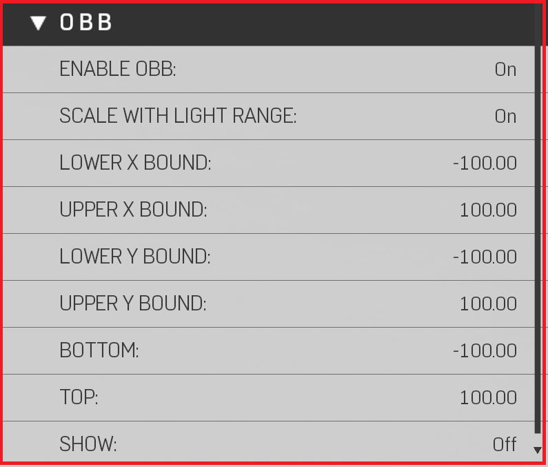

# OBB


OBB's (Oriented Bounding Box) are used Primarily as a performance tool, clamping light pixels to have more performant heatmaps (Use the Light/Shadow Heatmaps to see light pixel influence)


|Property Name|Description|
|:-- | :--|
|Enable OBB|Toggles on/off OBB (Reference Image L8, L9, L10)|
|Scale with Light Range|Automatically scales the bounds if ""Light Range" changes|
|Lower X Bound| Moves 1 side of the bounding box, setting can not be higher than Upper X Bound |
|Upper X Bound| Moves 1 side of the bounding box, setting can not be higher than Lower X Bound |
|Lower Y Bound| Moves 1 side of the bounding box, setting can not be higher than Upper Y Bound |
|Upper Y Bound| Moves 1 side of the bounding box, setting can not be higher than Lower Y Bound |
|Bottom|Moves the Bottom of the Volume|
|Top|Moves the Bottom of the Volume|
|Show | Always render OBB Volume|

