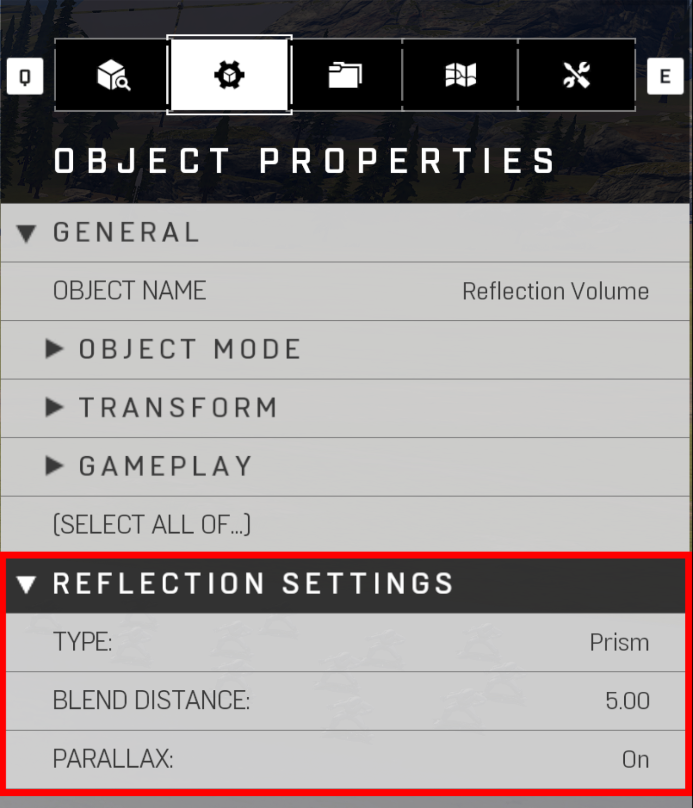

# Reflection Volumes

Reflection Volumes are a capture of a scene from the volume (Chrome Sphere, also known as Cubemaps). This capture displays reflections on geometry that enters that volume. High metal values are highly recommended to use a Reflection volume, such as spartan visors, forerunner hexes, or other metal objects.


There is a max limit of 15 manually placed Reflection Volumes, plus 1 global default reflection volume centered around: X=0,Y=0,Z=1000


|Property Name|Description|
|:-- | :--|
|Type |Shape of the refection volume <ul><li>Prism: Useful for boxed shaded environments (Reference Image Prism Reflection Volume)</li><li>Sphere: Useful for curved shaped environments (Reference Image Sphere Reflection Volume)</li></ul>|
|Blend Distance | Fades the edges of the reflection volume (Lower settings will have a sharp edge / Higher settings will have a softer edge). (Reference Image Blend Distance '0' and '15') |
|Parallax | Toggle on/off parallax correction to reflection from volume |

