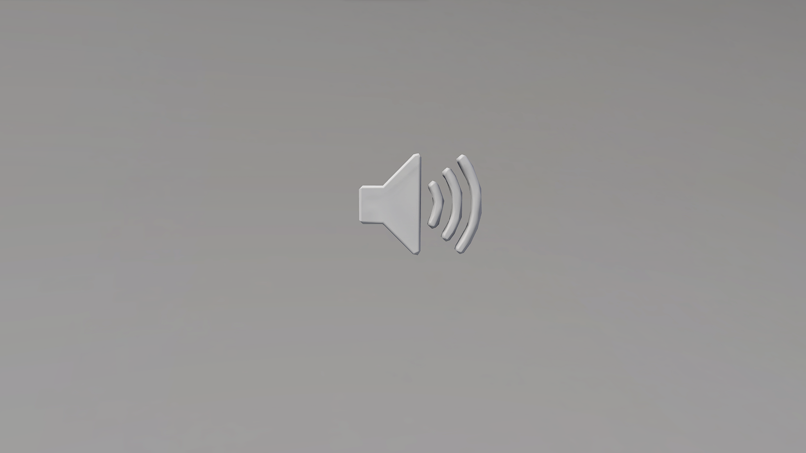

# Audio Emitter

## Description

Object that plays a sound at its location. Audio can be also controlled using Node Graph functions.

## Object Properties

### Advanced Properties

* Friendly Sounds
* Enemy Sounds

Sound Options

|Category - Sound Name|
|:--|
|\<none>

Alarms
<ul>        <li>Factory Alarm</li><li>Medium Machine Alarm</li>        <li>Red Light Siren</li><li>Small Machine Alarm</li></ul>

Animals
<ul><li>Alien Insects</li><li>Alien Insects 2D</li><li>Bat Movement</li><li>Bat Movement 2D</li><li>Bird Bay Woodpecker</li><li>Bird Bluebill Song</li><li>Bird Bluebreastedbandy Song</li><li>Bird Bronbobojo Call</li><li>Bird Cryingjay Song</li><li>Bird Goldenbabbler Song</li><li>Bird Keranger Call</li><li>Bird Longrobin Song</li><li>Bird Nighthowler Song</li><li>Bird Northernhooter Call</li><li>Bird Nuthatch Song</li><li>Bird Ravenbeak Call</li><li>Bird Readbreastedbandy Song</li><li>Bird Rednape Call</li><li>Bird Ridgepinner Song</li><li>Bird Ringfisher Call</li><li>Bird Rosefinch Call</li><li>Bird Sadloon Song</li><li>Bird Seedeater Call</li><li>Bird Sleepingheron Call</li><li>Bird Smallchestedrob Call</li><li>Bird Stonechatter Song</li><li>Bird Whistler Call</li><li>Bird Whitetailedwarbler Call</li><li>Bird Wildsapper Call</li><li>Bird Yellowbeakeryarger Call</li><li>Bird Yellowthroat Song</li><li>Cat Fight</li><li>Cavern Birds A</li><li>Cavern Birds Cowbird Distant</li><li>Flies Buzz</li><li>Frog Buzz</li><li>Frog Buzz 2D</li><li>Frog Song</li><li>Frog Song 2D</li><li>Insect Cricket Chirp</li><li>Insect Cricket Click</li><li>Insect Cricket Song A</li><li>Insect Cricket Song B</li><li>Large Alien</li><li>Mammal Elksetter Call B</li><li>Mammal Larper Call</li><li>Mammal Mirk Call</li><li>Mammal Moonlighter Call</li><li>Mammal Priareferret Call</li><li>Mammal Snoutedpossum Call A</li><li>Mammal Wrangler Call</li><li>Medium Alien</li><li>Olive Pig Angry</li><li>Olive Pig Idle</li><li>Olive Pig Startled</li><li>Random Birds 2D</li><li>Small Alien</li><li>Whale Calls Timmy</li><li>Whale Underwater</li></ul>

Characters
<ul><li>Jackal Distant</li></ul>

Computers
<ul><li>Antenna Tuning</li><li>Beep Boop Loop</li><li>Broken Screen A</li><li>Broken Screen B</li><li>Computer Beep A</li><li>Computer Beep B</li><li>Computer Beep C</li><li>Computer Beep D</li><li>Computer Beep E</li><li>Computer Beep F</li><li>Computer Beep G</li><li>Computer Panel A</li><li>Computer Panel B</li><li>Computer Panel C</li><li>Computer Panel D</li><li>Computer Panel E</li><li>Computer Room Beep</li><li>Computer Room Blips</li><li>Computer Room Sci Fi</li><li>Computer Screen A</li><li>Computer Screen B</li><li>Forerunner Terminal Medium</li><li>Forerunner Terminal Small</li><li>Fuel Monitor Beep A</li><li>Fuel Monitor Beep B</li><li>Fuel Monitor Screen A</li><li>Fuel Monitor Screen B</li><li>Glitch Loop</li><li>Large Monitor</li><li>Machine Room Beeps A</li><li>Machine Room Beeps B</li><li>Machine Room Blips A</li><li>Machine Room Blips B</li><li>Machine Room Computer B</li><li>Regulation Beep</li><li>Server Room Beep</li><li>Server Room Blips A</li><li>Server Room Blips B</li><li>Server Room Bloops</li><li>Server Room Chirps A</li><li>Server Room Glitch A</li><li>Small Fan A</li><li>Small Fan B</li><li>Small Fan C</li><li>Small Fan D</li><li>Small Fan E</li><li>Station Loop</li></ul>

Debris
<ul><li>Dust Drift Large</li><li>Dust Hanging Small</li><li>Sanddust</li></ul>

Door
<ul><li>Door A</li><li>Door B</li><li>Door C</li><li>Door D</li><li>Door E</li></ul>

Energy
<ul><li>Beam Pulse Large</li><li>Beam Pulse Medium</li><li>Beam Still Large</li><li>Beam Still Medium</li><li>Beam Still Small</li><li>Covenant Medium Forge</li><li>Covenant Small Forge</li><li>Energy Tank Hum</li><li>Energy Tank Hum Left</li><li>Energy Tank Hum Right</li><li>Forerunner Spiral</li><li>Forerunner Suck</li><li>Forerunner Vent Red A</li><li>Slip Space Idle</li></ul>

Fire
<ul><li>Burning Vehicle</li><li>Jet Large</li><li>Jet Medium</li><li>Large Generic</li><li>Medium</li><li>Pit</li><li>Pyre Large</li><li>Pyre Medium</li><li>Small</li></ul>

Forerunner Texture
<ul><li>A</li><li>B</li><li>C</li><li>D</li><li>E</li><li>F</li><li>G</li><li>H</li><li>I</li><li>J</li><li>K</li><li>L</li><li>M</li><li>N</li><li>O</li></ul>

Hologram
<ul><li>Covenant Galaxy Large</li><li>Covenant Galaxy Medium</li><li>Covenant Hex Dome</li><li>Orb</li><li>Starfield Blue</li><li>Starfield Red</li></ul>

Human
<ul><li>Crowd Cheer Large</li><li>Crowd Cheer Small</li><li>Crowd Walla Small</li><li>Distant Screams</li></ul>

Insects
<ul><li>Bug Swarm Large</li><li>Bug Swarm Medium</li><li>Bug Swarm Small</li><li>Desert Chirps</li><li>Desert Chirps 2D</li><li>Flying Insect A</li><li>Flying Insect B</li><li>Flying Insect C</li><li>Forerunner Bug Medium</li><li>Insect Hum</li><li>Insect Purr</li></ul>

Lights
<ul><li>Hum A</li><li>Hum C</li><li>Hum E</li><li>Hum F</li><li>Industrial Buzz</li><li>Industrial Light Hum A</li><li>Industrial Light Hum B</li><li>Light Hum B</li></ul>

Machines
<li>Air Filtration Vent A</li><li>Air Filtration Vent B</li><li>Antenna Hum A</li><li>Broken Fan A</li><li>Broken Fan B</li><li>Broken Fan C</li><li>Broken Fan D</li><li>Cable Rattles A</li><li>Cable Rattles B</li><li>Distant Giant Boosters</li><li>Distant Servos</li><li>Electrical Arcs</li><li>Electrical Buzz A</li><li>Electrical Buzz B</li><li>Fan A</li><li>Fan B</li><li>Fan C</li><li>Fan D</li><li>Fan Large A</li><li>Fan Large B</li><li>Fan Rattle</li><li>Fan Rattle A</li><li>Fan Wobble</li><li>Fuel Filter Machine A</li><li>Fuel Filter Machine B</li><li>Fuel Pipe Pump A</li><li>Fuel Pipe Pump B</li><li>Fuel Pump Movement</li><li>Fuse Panel</li><li>Generator Idle Sputter</li><li>Industrial Vent A</li><li>Industrial Vent B</li><li>Lab Ceiling Engine</li><li>Large Fan</li><li>Machine Coil A</li><li>Machine Coil B</li><li>Machine Hum A</li><li>Machine Hum B</li><li>Machine Panel Wall A</li><li>Machine Panel Wall B</li><li>Machine Room Counter</li><li>Machine Room Hum A</li><li>Machine Room Hum B</li><li>Machine Rumble A</li><li>Machine Rumble B</li><li>Machine Rumble C</li><li>Machine Rumble D</li><li>Machine Rumble E</li><li>Panel Hum</li><li>Pipe Ceiling Blue</li><li>Pipe Large A</li><li>Pipe Large B</li><li>Pipe Wall</li><li>Pipe Wall Blue</li><li>Server Rack Hum</li><li>Server Room Hum A</li><li>Server Room Hum B</li><li>Small Factory Fan Arc</li><li>Rank Upper</li><li>Thruster Large</li><li>Thruster Medium</li><li>Turbine Spin</li><li>Turbine Spin Damaged</li><li>Vehicle Thruster A</li><li>Vehicle Thruster B</li><li>Vehicle Thruster C</li><li>Vehicle Thruster D</li><li>Vent Idle Hum</li><li>Vent Large A</li><li>Vent Large B</li><li>Vent Large C</li><li>Vent Large D</li><li>Vent Rattle Interior A</li><li>Vent Rattle Interior B</li><li>Wall Tank A</li><li>Wall Tank B</li><li>Wall Vent A</li><li>Wall Vent B</li>

Metal
<li>Cell Rattles</li><li>Distant Jail A</li><li>Distant Jail B</li><li>Distant Jail C</li><li>Distant Metal Movement</li><li>Distant Ship Interior</li><li>Distant Ship Rattle</li><li>Fence Rattle A</li><li>Fence Rattle B</li><li>Gate Rattle</li><li>Large Shifts</li><li>Metal Impacts Distant</li><li>Metal Movement Cave A</li><li>Metal Movement Cave B</li><li>Metal Movement Interior A</li><li>Metal Movement Interior B</li><li>Metal Shifting</li><li>Metal Ticks</li><li>Pipe Movement</li><li>Pipe Rattle A</li><li>Pipe Rattle B</li><li>Pipe Rattle C</li><li>Pipe Running Water</li><li>Pipe Tiny Rattle A</li><li>Pipe Tiny Rattle B</li><li>Rattle Movements</li><li>Scaffolding Shake</li><li>Shift Movements</li><li>Small Stress</li><li>Stress Movements</li>

Nature
<li>Bubbling Tar</li><li>Distant Thunder</li><li>Ice Crack Shifts</li><li>Ice Glacier Groans</li><li>Lava Flow</li><li>Lava Flow Large</li><li>Lava Flow Medium</li><li>Lava Flow Small</li><li>Lightning Strike</li><li>Rock Cliff Creaks & Groans</li><li>Rock Cliff Debris</li><li>Rock Movement</li><li>Rock Movement Distant</li><li>Rock Tumbles A</li><li>Rock Tumbles B</li><li>Rock Tumbles C</li><li>Rock Tumbles D</li>

Plasma
<li>Fire Large A</li><li>Fire Large B</li><li>Fire Large C</li><li>Fire Large D</li>

Smoke
<li>Covenant</li><li>Embers</li><li>Glow Covenant</li><li>Large</li><li>Sustain</li>

Sparks
<li>Blue</li><li>Red</li><li>Waterfall</li>

Spooky
<li>Cave Groans</li><li>Cave Movements</li><li>Distant Impacts</li><li>Forest Movements</li><li>Goofy Ghost</li><li>Horror Moments</li><li>Spooky Ghosts</li>

Steam
<li>Burst</li><li>Curtain</li><li>Fall</li><li>Falling Large</li><li>Falling Medium</li><li>Pipe Hiss A</li><li>Pipe Hiss B</li><li>Pipe Hiss C</li><li>Pipe Hiss D</li><li>Pipe Hiss E</li><li>Pipe Hiss F</li><li>Pipe Sprout</li><li>Pressure</li><li>Rise</li><li>Rising</li><li>Rising Large</li><li>Steam Heavy</li>

Urban
<li>Construction City</li><li>Covenant Temple Chant</li><li>Fueling Station</li><li>Occluded Construction</li><li>Traffic City</li>

Water
<li>Cave Drip A</li><li>Cave Drip B</li><li>Cave Drip C</li><li>Cave Drip D</li><li>Cave Drip E</li><li>Cave Drip F</li><li>Distant Drip</li><li>Drip Drops Large</li><li>Generic Bubbles Fast</li><li>Generic Bubbles Thick</li><li>Generic Drip Fast</li><li>Generic River Large</li><li>Generic River Medium</li><li>Generic River Small</li><li>Generic Waterfall Large</li><li>Generic Waterfall Medium</li><li>Generic Waterfall Small</li><li>Heavy Splashes</li><li>Lake Laps</li><li>Light Splashes</li><li>Metal Drip A</li><li>Metal Drip B</li><li>Metal Drip C</li><li>Metal Drip D</li><li>Metal Drip E</li><li>Ocean Laps Calm</li><li>Ocean Waves</li><li>Sonar Ping</li><li>Underwater</li><li>Underwater Bubble Stream</li><li>Underwater Bubble Stream Huge</li><li>Underwater Bubble Stream Large</li><li>Underwater Bubble Stream Small</li><li>Underwater Bubbles</li><li>Underwater Bubbles Rising Huge</li><li>Underwater Bubbles Rising Large</li><li>Underwater Bubbles Rising Medium</li><li>Underwater Bubbles Rising Small</li><li>Underwater Pulse</li><li>Wall Trickle Heavy</li><li>Wall Trickle Light</li><li>Waterfall Canyon Far</li><li>Waterfall Canyon Under</li><li>Window Rain</li>

Wind
<li>Cave Cliff Left</li><li>Cave Cliff Right</li><li>Desert Debris</li><li>Dust Gusts</li><li>Edge Wind</li><li>Ledge Huge</li><li>Ledge Snow Zone</li><li>Lonely Gusts</li><li>Sandstorm</li><li>Sandstorm Metal</li><li>Small Twister</li><li>Through Trees</li>
|
