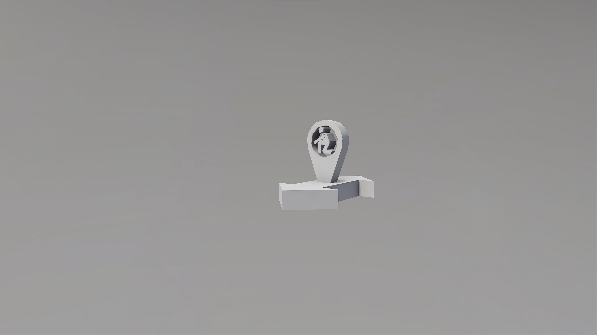

# Bot Crouch Two Way

## Description

Forces bots to crouch while inside the boundary area. Bottom edges of the object boundary must intersect the nav mesh; size and rotate as needed. To see Nav Mesh data, toggle _Nav Mesh Visualization_ to ON in the **Tool Settings** menu.

