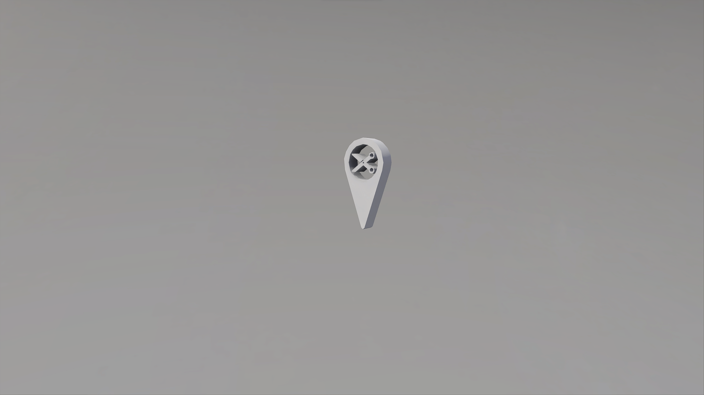

# Nav Cutter

## Description

Used to prevent nav mesh data from building with the object boundary. Set _Nav Cutter Type_ to Jump Hint to prevent auto generated jump hints, otherwise all nav mesh data is cut. Bottom edges of the object boundary must intersect the nav mesh; size as needed.

