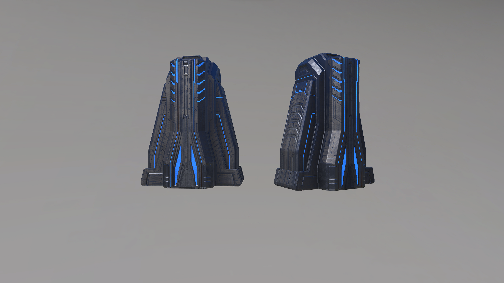

# Scriptable Switch Forerunner Terminal Worn

## Description

An interactable switch that triggers the [**On Object Interacted**](../../../scripting/events-custom/on-object-interacted.md) node when pressed.

