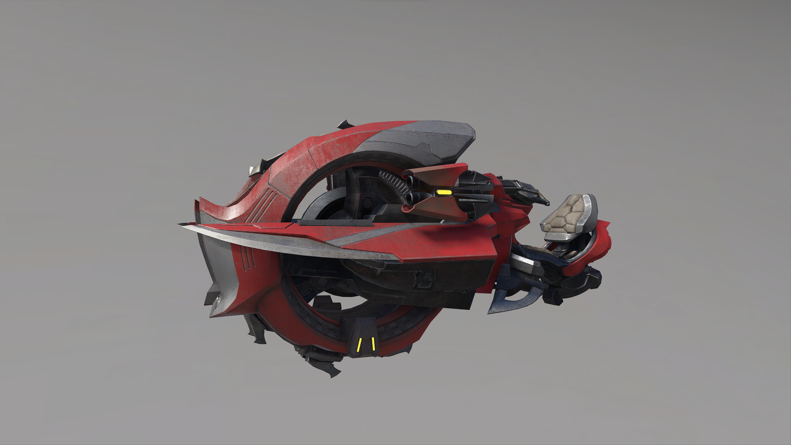

# Chopper

## Description

Banished fast-attack bike armed with two spike cannons. The weaponized front wheel gives the bike traction and threshes anything that falls beneath it. A gravity boost gives the Chopper short spurts of speed for gap closing potential. Brutes find great joy in using the spike cannons to disorient their prey, then activating the boost to ram.

