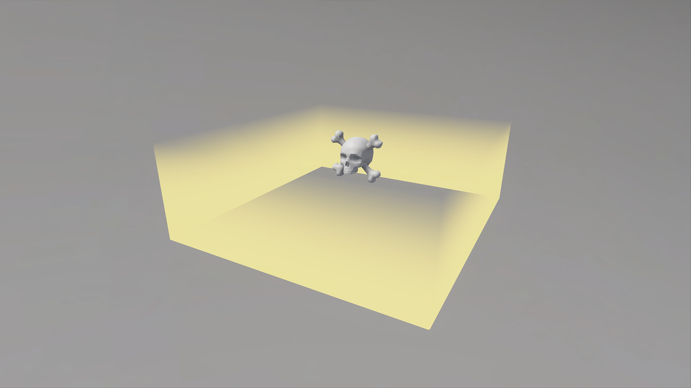

# Kill Volume

<!-- # Kill Volume

## Description

Volume that instantly kills players who enter it. Commonly used to prevent players from getting stuck when they leave the gameplay area of a map. Use a [**Safe Volume**](safe-volume.md) to create a safe zone within a **Kill Volume**. -->
