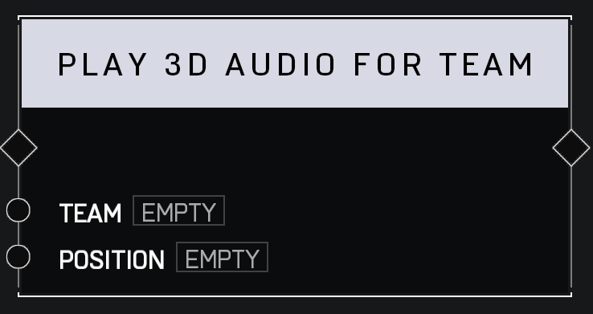

# Play 3D Audio For Team

## Description

Plays a 3D audio clip audible to all players on the _TEAM_ within range of the _Position_.

## Arguments

Actions:

- Input
- Output

Inputs:

- Team
- Position
