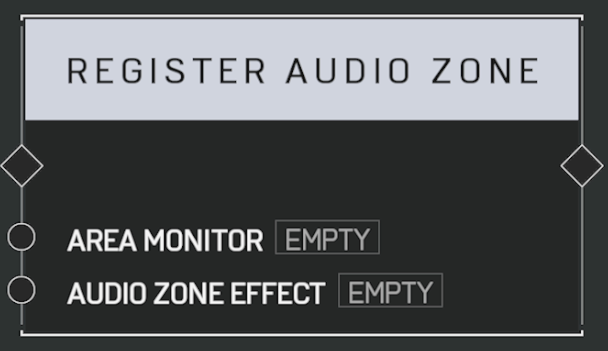

# Register Audio Zone

Plays an _Area Monitor_ as an Audio Zone. Audio Zones apply an _Audio Effect_ to players inside their Boundary, affecting how those players hear other sounds in game. Audio Zones can only have one Audio Effect active at a time.

## Arguments

Actions:

- Input
- Output

Inputs:

- Area Monitor
- Audio Zone Effect
