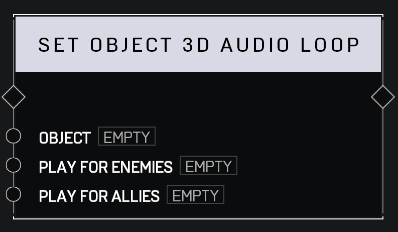

# Set Object 3D Audio Loop

## Description

Sets a 3D audio loop to play on the _Object_. Can be set to play only for allied or opposing players, which uses the object's Team setting in the **Object Properties** menu.

## Arguments

Actions:

- Input
- Output

Inputs:

- Object
- Play For Enemies
- Play For Allies
