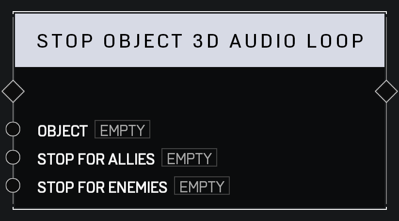

# Stop Object 3D Audio Loop

## Description

Stops the audio loop currently playing on the _Object_. Can stop sounds playing for allied or opposing players independently.

## Arguments

Actions:

- Input
- Output

Inputs:

- Object
- Stop For Allies
- Stop For Enemies
