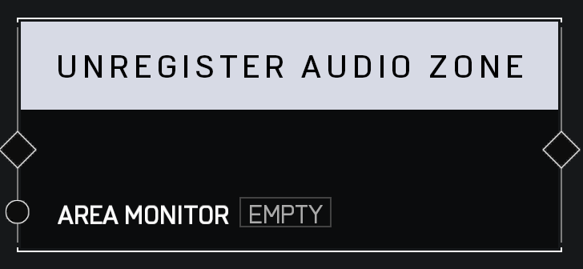

# Unregister Audio Zone

## Description

Unregisters an _Area Monitor_ as an Audio Zone so that it no longer applies Audio Effects to players in its Boundary. When the zone is unregistered, it will remove its audio effect on any players standing in its Boundary.

## Arguments

Actions:

- Input
- Output

Inputs:

- Area Monitor
