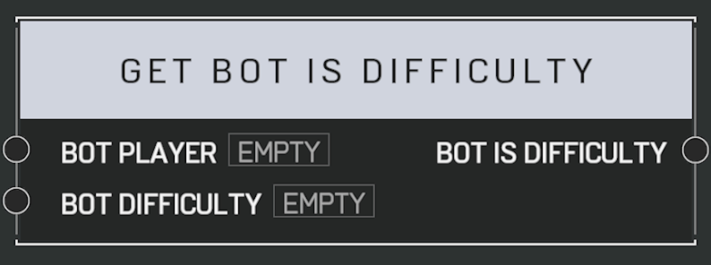

# Get Bot Is Difficulty

Returns true if the _Bot Player_ matches the given _Bot Difficulty_. Always returns false if the _Bot Player_ is not actually a bot.

## Arguments

Inputs:

- Bot Player
- Bot Difficulty

Outputs:

- Bot Is Difficulty
