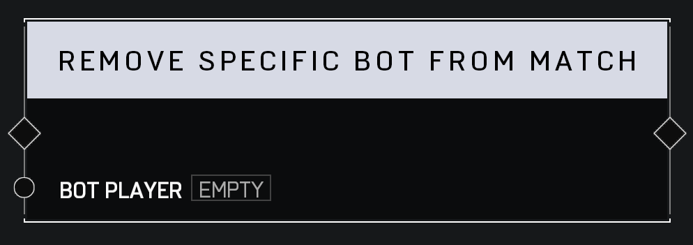

# Remove Specific Bot From Match

## Description

Removes the _Bot Player_ from the game. If the player is not actually a bot, there is no effect.

## Arguments

Actions:

- Input
- Output

Inputs:

- Bot Player
