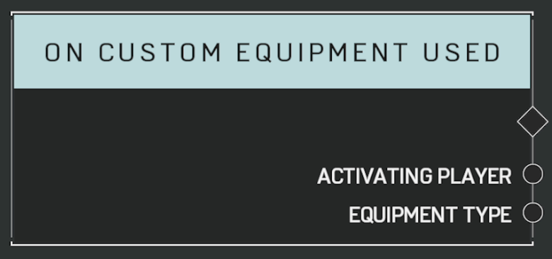

# On Custom Equipment Used

## Description

Event called in the same conditions as **On Equipment Used** but only when the equipment used is a Custom Equipment

## Arguments

Actions:

- Output

Outputs:

- Activating Player
- Equipment Type
