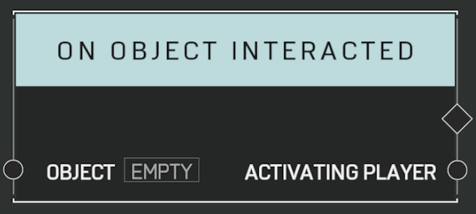

# On Object Interacted

## Description

Event called when a player interacts with the _Object_. Most commonly used with a scriptable switch.

## Arguments

Actions:

- Output

Inputs:

- Object

Outputs:

- Activating Player
