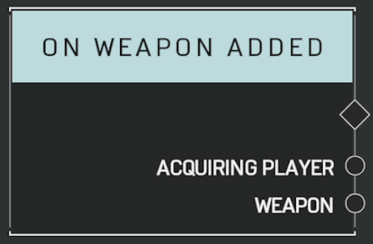

# On Weapon Added

## Description

Event called when a weapon is added to a player's inventory. Ammo refills for a weapon a player is already holding will NOT trigger this event.

## Arguments

Actions:

- Output

Outputs:

- Acquiring Player
- Weapon
