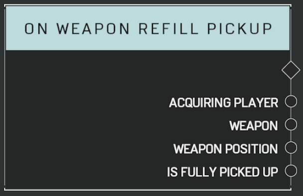

# On Weapon Refill Pickup

## Description

Event called when a weapon is picked up for an ammo refill. _Is Fully Picked Up_ will return true if the weapon was despawned.

## Arguments

Actions:

- Output

Outputs:

- Acquiring Player
- Weapon
- Weapon Position
- Is Fully Picked Up
