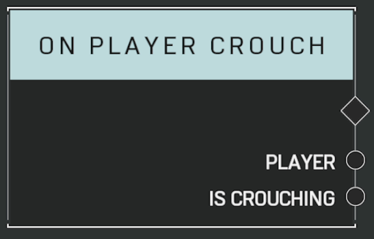

# On Player Crouch

## Description

Event called when any player changes their crouch state. _Is Crouching_ will be true when a player crouches and false when they stand back up.

## Arguments

Actions:

- Output

Outputs:

- Player
- Is Crouching
