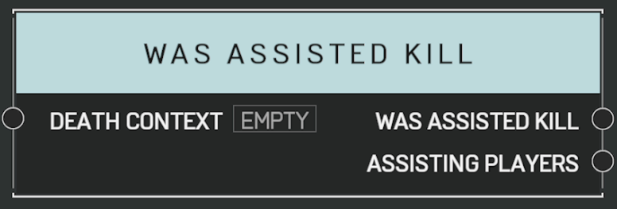

# Was Assisted Kill

## Description

Queries a _DeathContext_ from the [**On Player Killed**](on-player-killed.md) event. Returns true if other players assisted in the kill.

## Arguments

Actions:

- Output

Inputs:

- Death Context

Outputs:

- Was Assisted Kill
- Assisting Players
