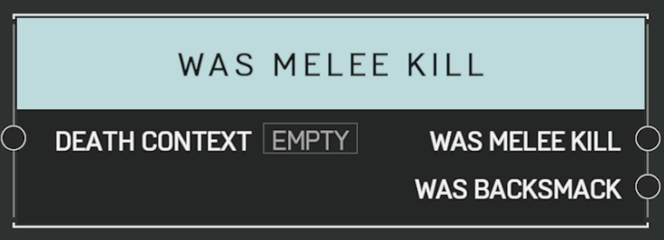

# Was Melee Kill

## Description

Queries a _DeathContext_ from the [**On Player Killed**](on-player-killed.md) event. Returns true if the killing blow came from a melee damage source.

## Arguments

Actions:

- Output

Inputs:

- Death Context

Outputs:

- Was Melee Kill
- Was Backsmack
