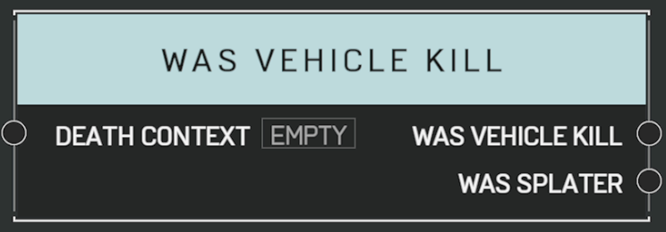

# Was Vehicle Kill

## Description

Queries a _DeathContext_ from the [**On Player Killed**](on-player-killed.md) event. Returns true if the killing blow came from a vehicle damage source.

## Arguments

Actions:

- Output

Inputs:

- Death Context

Outputs:

- Was Vehicle Kill
- Was Splatter
