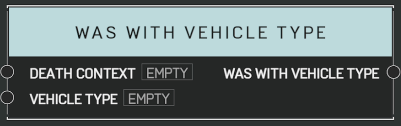

# Was With Vehicle Type

## Description

Queries a _DeathContext_ from the [**On Player Killed**](on-player-killed.md) event. Returns true if the killing blow came from a matching _Vehicle Type_. Unreliable if the player has left the vehicle since the kill.

## Arguments

Actions:

- Output

Inputs:

- Death Context
- Vehicle Type

Outputs:

- Was With Vehicle Type
