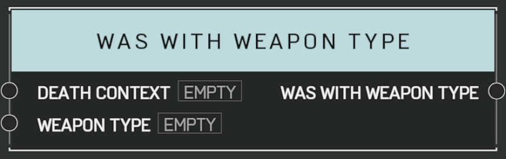

# Was With Weapon Type

## Description

Queries a _DeathContext_ from the [**On Player Killed**](on-player-killed.md) event. Returns true if the killing blow came from a matching _Weapon Type_.

## Arguments

Actions:

- Output

Inputs:

- Death Context
- Weapon Type

Outputs:

- Was With Weapon Type
