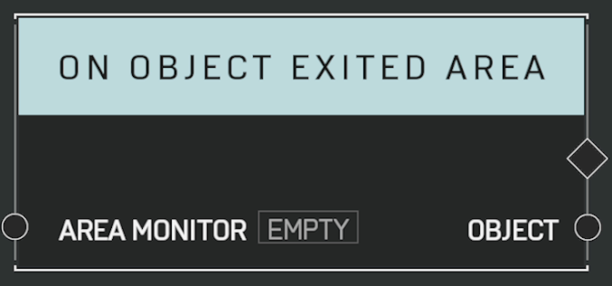

# On Object Exited Area

Event called when an object exits the _Area Monitor's_ boundary. Returns which object has exited the boundary.

### Parameters

Actions:

- Output

Inputs:

- Area Monitor

Outputs:

- Object
