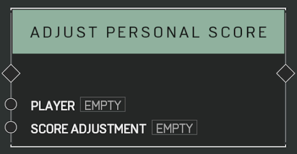

# Adjust Personal Score

## Description

Adjusts the score of the _Player_ the current round which affects placement order in the scoreboard, among other things. Affects a different value than [**Adjust Player Points**](adjust-player-points.md).

## Arguments

Actions:

- Input
- Output

Inputs:

- Player
- Score Adjustment
