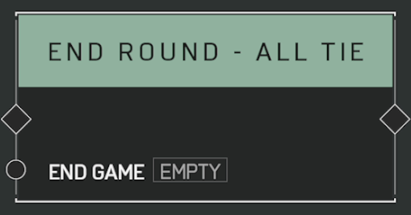

# End Round - All Tie

## Description

Ends the current round immediately, recording a tie for all participants regardless of score. If _End Game_ is set to true, the game will end regardless of how many rounds were remaining.

## Arguments

Actions:

- Input
- Output

Inputs:

- End Game
