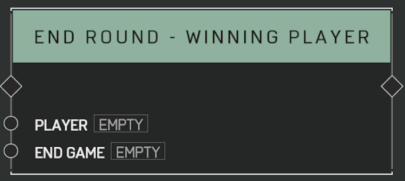

# End Round - Winning Player

## Description

Ends the current round immediately, recording a win for the _Player_ regardless of score. If _End Game_ is set to true, the game will end regardless of how many rounds were remaining.

## Arguments

Actions:

- Input
- Output

Inputs:

- Player
- End Game
