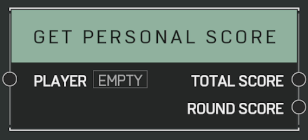

# Get Personal Score

## Description

Gets the _Player_ Personal Score, which affects placement order in the scoreboard, among other things. Provides Personal Score for the current round as well as the whole match. Use [**Get Player Points**](get-player-points.md) if want to measure progress to victory

## Arguments

Inputs:

- Player

Outputs:

- Total Score
- Round Score
