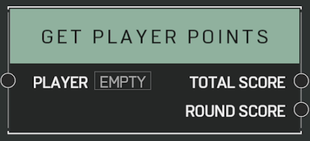

# Get Player Points

## Description

Gets the _Player's_ point total. Provides points for the current round as well as the whole match.

## Arguments

Inputs:

- Player

Outputs:

- Total Score
- Round Score
