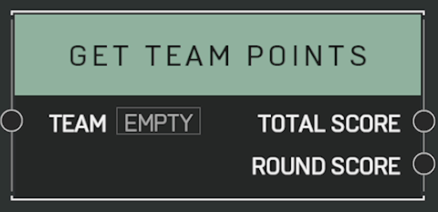

# Get Team Points

## Description

Gets the point total for the _Team_. Returns points for the current round as well as the whole match.

## Arguments

Inputs:

- Team

Outputs:

- Total Score
- Round Score
