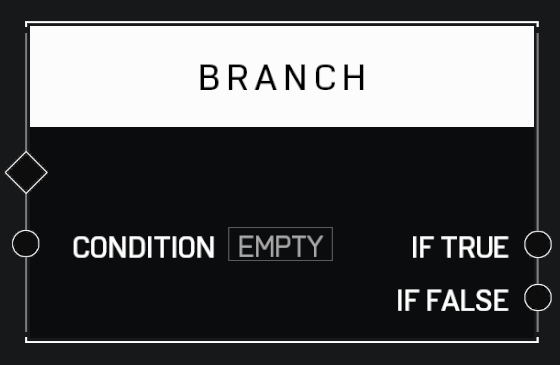

# Branch

## Description

Receives a boolean _Condition_ and does one of two things if the _Condition_ is true or false. Connect the _If True_ and _If False_ to the diamond of the pin you want to execute for each case.

## Arguments

Actions:

* Input

Inputs:

* Condition

Outputs:

* If True
* If False
