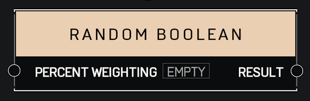

# Random Boolean

## Description

Returns a random true/false value, with the given chance to return true. For example, choose a _Percent Weighting_ of 60 to return true 60% of the time.

## Arguments

Inputs:

* Percent Weighting

Outputs:

* Result
