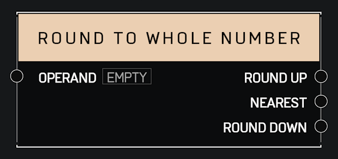

# Round To Whole Number

## Description

Returns the _Operand_ rounded up, rounded down, and rounded to the nearest whole number.

## Arguments

Inputs:

* Operand

Outputs:

* Round Up
* Nearest
* Round Down
