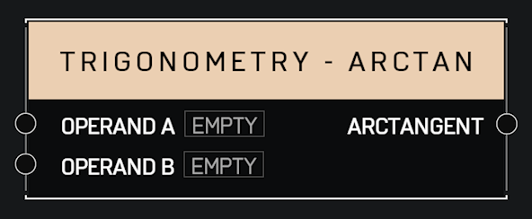

# Trigonometry - Arctan

## Description

Returns the inverse tangent of A/B in radians, using the signs of both parameters to find the quadrant of the result. Returns 0 if both A and B are 0.

## Arguments

Inputs:

* Operand A
* Operand B

Outputs:

* Arctangent
