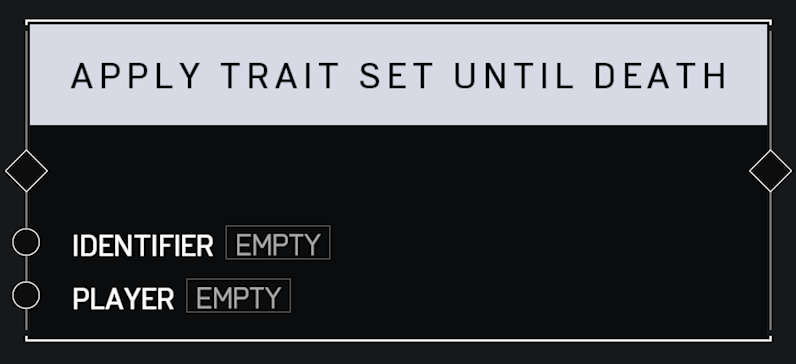

# Apply Trait Set Until Death

## Description

Applies the **Trait Set** with the matching _Identifier_ to the _Player_ until the player dies.

## Arguments

Inputs:

* Monitor Object

Outputs:

* Area Monitor
