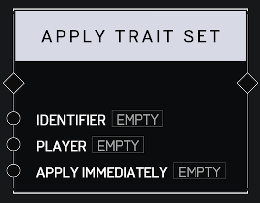

# Apply Trait Set

## Description

Applies the **Trait Set** with the matching _Identifier_ to the _Player_. Optionally _Apply Immediately_ or wait for the next respawn to take effect.

## Arguments

Actions:

* Input
* Output

Inputs:

* Identifier
* Player
* Apply Immediately
