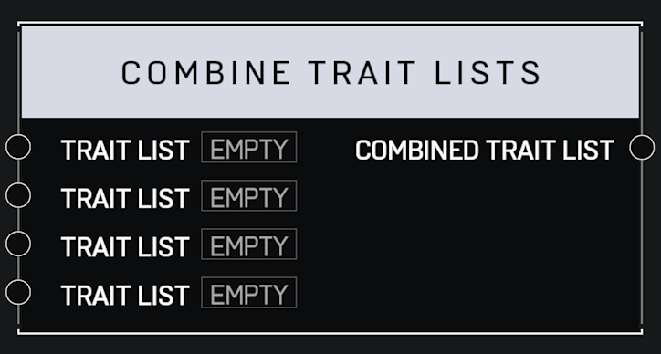

# Combine Trait Lists

## Description

Returns a list combining all the input _Trait Lists_. Duplicate trait values will be removed from the new list, if they exist.

## Arguments

Inputs:

* Trait List
* Trait List
* Trait List
* Trait List

Outputs:

* Combined Trait List
